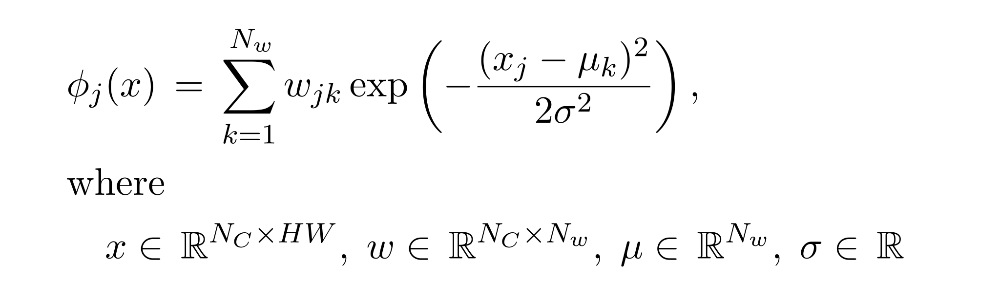

## PyTorch Extension: Weighted Sum of Gaussian RBFs

This extension implements a differentiable operator that calculates a weighted sum of Gaussian radial basis functions.

The backward pass gradients are calculated w.r.t. input image data *x* and weights *w*.

This implementation uses shared memory and
coalesced access to global memory (i.e., 32-byte aligned sequence).
For maximum memory bandwidth, the image size (width &times; height &times; sizeof(float))
as well as weights vector size (*N**w* &times; sizeof(float)) should be a multiple of 32.
See [this page](https://docs.nvidia.com/cuda/cuda-c-best-practices-guide/index.html#memory-optimizations)
for more information on memory optimizations.

#### Example
<pre>
>>> import torch
>>> from gaussian_rbf import GaussianRBF_CUDA
>>> batch_size = 10
>>> num_channels = 64
>>> num_nodes = 32
>>> size_x = size_y = 320
>>> x = torch.rand(batch_size, num_channels, size_y, size_x, device='cuda:0') * 2 - 1
>>> weights = torch.rand(num_channels, num_nodes, device='cuda:0', requires_grad=True)
>>> mu = torch.linspace(-1, +1, num_nodes, device='cuda:0')
>>> sigma = torch.tensor(float(mu.max()-mu.min())/num_nodes, device='cuda:0')
>>> y = GaussianRBF_CUDA.apply(x, weights, mu, sigma)
>>> y.sum().backward()
</pre>

#### Links
1. https://docs.nvidia.com/cuda/
2. https://pytorch.org/
